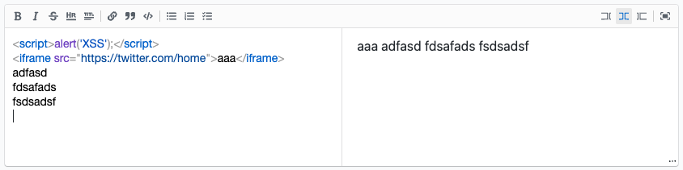
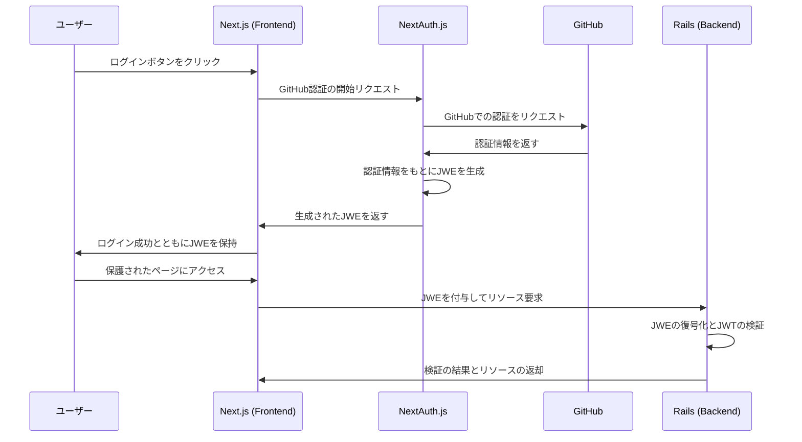

# エンジニア DB のフロントエンド

## 技術スタック

技術選定は、大前提として知識キャッチアップのために、モダンでかつ人気のあるもの、Vercel が推しているものを優先的に選定しています。

### フレームワーク

Next.js 13 (App Router)で実装しています。
これから Next.js は App Router がメインとなってくると思うので App Router を採用しました。
データをフェッチする処理は全て SSR で記述し、それ以外の部分もなるべく CSR は使わないように実装しています。
ネット上の意見において、App router は、バグが多かったり、情報が少ない状況で選定しない方針が散見されましたが、今回は自分の技術力アップのために強引に採用しました。
結果的には、App router を採用してよかったと思っています。Route Groups や Layout を使うことで、ディレクトリ(URL)の設計がしやすく、またディレクトリから設計の意図が読み取りやすいので管理しやすいと感じました。
できるだけ SSR や ISR で実装を使うよう意識したので、おのずと状態管理をしないように設計・実装するようになっていきました。
学習教材としては、Nest.js が公式で出している、Learn Next.js がわかりやすくて良かったです。

参考

- [Learn Next.js](https://nextjs.org/learn)

### 言語

TypeScript を採用しています。型定義していた方が実装が捗ります。

### CSS ライブラリ

TailwindCSS をベースで実装しています。
UI コンポーネントとして、shadcn/ui と tremor を採用しましたが、いずれも TailwindCSS ベースのライブラリです。
shadcn/ui は、atomic デザインでいうところの atom,module レベルのコンポーネントに利用し、
tremor は、ダッシュボードのグラフ等のおしゃれにデータを表示させる用のコンポーネントに採用しています。

参考

- [TailwindCSS](https://tailwindcss.com/)
- [Tailwind Variants](https://www.tailwind-variants.org/)
- [shadcn/ui](https://ui.shadcn.com/)
- [tremor](https://www.tremor.so/)

### markdown 用のライブラリ

本サービスは、ターゲットがエンジニアなので、投稿を markdown でできるように設計しました。
markdown のエディターと表示には、Next.js 公式が推している react-md-editor を採用しています。
公式のマニュアルを見ほな簡単に実装できましたが、デザイン感があってない気がするので、今後変更するかもしれません。

- [react-md-editor](https://uiwjs.github.io/react-md-editor)
- [セキュリティ sanitizer](https://github.com/rehypejs/rehype-sanitize)
- 

### UI カタログ

Storybook を採用しています。

採用理由はコンポーネントの採用利用率を上げるため、UI テストを実装できるため、今後の保守運用の 3 点です。
そのうち最も魅力的なのは、テストを実装できることでした。詳細は後述しますが、Storybook を利用したテストは非常に魅力的です。
Storybook の採用デメリットとして、メンテコストが高い、腐らせてしまうなどが多いようでしたが、下記記事が参考にすると、概ね解消されると思いました。Storybook を採用しても、「プロジェクトの複雑化を避け、ファイル生成のコストを共通化で抑え、スナップショットテストと絡めてリターンを得る。」ことが可能になります。

参考

- [Storybook を導入する際にやるべきこと 3 選](https://zenn.dev/sum0/articles/9463d16d9d40e2)
- [React 向け Storybook のチュートリアル](https://storybook.js.org/tutorials/intro-to-storybook/react/ja/get-started/)

### テスト

テストは、ESLint と Pretiier による静的解析、Storybook による UI の単体テストと結合テスト、Jest によるビジネスロジックや関数の単体テストを実装しています。いずれも Github Actions でプルリク時に自動テストするようにしています。
なお、E2E テストはコストが高かかったので、導入を諦めました。手動でチェックします。。

フロントエンドのテスト手法として、Jest や React-testing による単体テストや結合テストが散見されましたが、〇〇コンポーネントに「〇〇」と書いてあればテスト OK のような例が散見されており、効果が薄そうだなぁ感じていました。さらにテスト手法を調べていると、Storybook でインタラクションテストやビジュアルテストリグレッションテストが実装できることがわかりました。なので、UI に関するテストはそちらで実装するように決めました。

一部、JS で記述しているビジネスロジックや汎用的な関数は、Jest でテストするようにしています。

参考

- [フロントエンドのテスト戦略について考える](https://zenn.dev/koki_tech/articles/a96e58695540a7)
- [[Next.js]フロントテストのコストは Storybook で削減出来る](https://zenn.dev/sora_kumo/articles/8a79531e726b29#storybook-%E3%81%AE%E8%A8%AD%E5%AE%9A)
- [ESLint](https://eslint.org/)
- [Pretiier](https://prettier.io/)
- [Jest](https://jestjs.io/ja/)
- [Testing Library](https://testing-library.com/docs/react-testing-library/intro/)

## 認証について

本サービスは、エンジニアのみが登録して頂けるように、Github 認証のみを採用しています。
Next.js 側で、NextAuth.js を利用して認証を実装しています。

### フロー

NextAuth.js と GitHub での認証、NextAuth で生成された JWE を使用して、Rails で JWT を検証する認証



## ディレクトリ構成

\_components というディレクトリを切って、いい感じにコンポーネントを管理しています。
app 以下のディレクトリは、url に影響するので、ディレクトリ名は小文字ハイフンで統一しています。

```
.
├── app
│   ├── _components  # 全てにコンポーネント
│   │   ├── ui # atom, moduleレベルのコンポーネント
│   │   └── layout # 共通のheaderやfooterなど
│   ├── (authenticated)  # 認証後のページ
│   │   ├── _components # 認証後の共通コンポーネント
│   │   ├── engineers # エンジニアページ
│   │   │   ├── _components # エンジニアページの共通コンポーネント
│   │   │   ├── (root) # /engineersページ
│   │   │   │   ├── _components # /engineersページのコンポーネント
│   │   │   │   ├── layout.tsx # /engineersページのレイアウト、メタ情報
│   │   │   │   ├── page.tsx # /engineersページのデータフェッチ、コンポーネント配置
│   │   │   ├── [id] # /engineers/[id]以下のページ
│   │   │   └── layout.tsx # エンジニアページのレイアウト
│   │   ├── messages # DMページ
│   │   ├── mypage # マイページ
│   │   ├── posts # 投稿ページ
│   │   ├── quit # 退会ページ
│   │   └── layout.tsx
│   ├── (unauthenticated)  # 認証前のページ
│   ├── api  # Api Route
│   ├── globals.css
│   ├── layout.tsx  # 前ページ共通のレイアウト
│   ├── not-found.tsx
│   └── page.tsx  # 認証前後で、リダイレクトを設定している。
```

実装前に参考にしていた情報が見つからず、、代わりに調べているとこちらが私の思想に似ていたので共有しておきます。
参考

- [Next.js 13 の ディレクトリ構成](https://scrapbox.io/wwwy-dev/Next.js_13%E3%81%AE_%E3%83%87%E3%82%A3%E3%83%AC%E3%82%AF%E3%83%88%E3%83%AA%E6%A7%8B%E6%88%90)

## ポイント

- 画像投稿機能について、画像投稿前に、フロントエンド側で画像圧縮するようにした。
- レンダリングについて、基本的に SSR として、フォームなど状態管理が必要な部分のみを CSR にするようにした。データフェッチ部分は、必ずサーバーサイド側で実装するようにて、認証情報はクライアント側で扱わないようにした。また、データを集計するダッシュボードは、ISR にして、バックエンド側でバッチ処理を実装せずに、フロント側でキャッシュしたデータを扱うようにした。利用者が増えた時に再構築が必要かもしれないが、とりあえずこれでいいと思う。
- url 設計、UI, UX にはこだわった。クリエイティブは絶望的かもしれない。
- 無限スクロールとページネーションを使い分けている。投稿一覧ページは無限スクロールとし、ユーザー一覧&検索ページは、pagination はページネーションとしています。 使い分けのポイントは、SEO と UX、URL 設計 と思っています。
- App Router の機能をちゃんと理解して使っている。
- フロントエンド側でのキャッシュをちゃんとしました。（メッセージページがわかりやすい？）

## 課題・やりたいこと

- トップページのデザインをアウトソースしていい感じにした。
- ユーザーにできるだけ多くのユーザー情報を登録してもらえるような動線設計を詰めたい
- テスト手法について、もっと詰めていきたい。
- Next.js14 にアップデートしていきたい。
- バックエンドを Rails にしているが、Prisma などを使って Next.js に寄せていきたい。

## 開発者に向けて

### 環境変数

GITHUB_CLIENT_ID=hogehoge
GITHUB_CLIENT_SECRET=hogehoge
NEXTAUTH_SECRET=hogehoge
NEXT_PUBLIC_BACKEND_URL=http://localhost:3000
