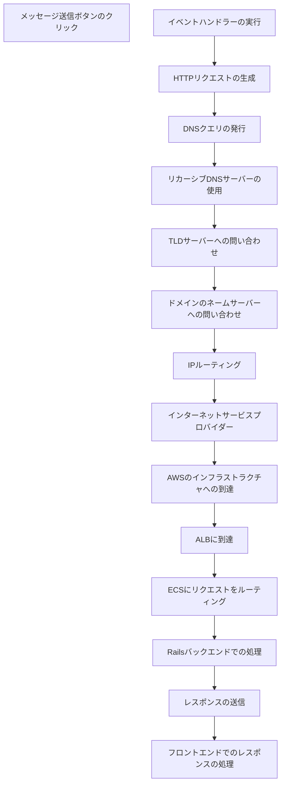

## メッセージ送信ボタンのクリック
- ユーザーがUI上の送信ボタンをクリックすると、Reactの `onClick` イベントがトリガーされます。
- このイベントは、特定のコンポーネント（例：`<SendMessageButton onClick={handleSubmit}>`）に結びつけられています。

## イベントハンドラーの実行
- `handleSubmit` 関数が実行されます。この関数内で、フォームに入力されたメッセージが状態管理（例：useStateやuseReducerを使用）から取得されます。
- メッセージデータと共に、ユーザーIDやセッショントークンなどの認証情報もリクエストに含まれる場合があります。

## HTTPリクエストの生成
- `axios` や `fetch` APIを使ってHTTP POSTリクエストが作成されます。このリクエストには、送信するメッセージの内容と必要なヘッダー（認証トークンなど）が含まれます。
- 例：`axios.post('/api/messages', { message: messageText, userId: userId }, { headers: { Authorization: Bearer ${token} } })`

## DNS解決
### ユーザーのデバイスによるDNSクエリの発行
- ユーザーがメッセージを送信する際、Reactアプリケーションが指定したAPIエンドポイント（例：api.example.com）に対してHTTPリクエストを生成します。
- このドメイン名をIPアドレスに変換するため、ユーザーのデバイスは最初にローカルDNSキャッシュを確認し、キャッシュにない場合は、設定されたDNSサーバーに対してクエリを送信します。

### リカーシブDNSサーバーの使用
- ローカルDNSサーバー（通常はISPによって提供される）はリカーシブDNSサーバーとして機能し、ドメイン名の解決を代行します。
- リカーシブDNSサーバーは、まずルートDNSサーバーにクエリを送り、TLD（トップレベルドメイン）サーバー（.comの場合）のアドレスを取得します。

### TLDサーバーへの問い合わせ
- TLDサーバーから、そのドメイン名の管理を担当するネームサーバー（ドメインの登録情報に基づく）のアドレスを取得します。

### ドメインのネームサーバーへの問い合わせ
- 最終的に、ドメインのネームサーバーに問い合わせて、api.example.comのIPアドレスを取得します。

### IPアドレスのキャッシュとリターン
- IPアドレスがリカーシブDNSサーバーによって取得されると、それは一定期間キャッシュされ、クライアントに返送されます。これにより、後続のリクエストが高速に処理されます。

## IPルーティング
### IPパケットの生成
- DNS解決後、ユーザーのデバイスは対象のサーバーのIPアドレスを持つHTTPリクエストをIPパケットとして生成します。

### ローカルネットワークへの送信
- 生成されたパケットは、ユーザーのローカルネットワーク（例えば、自宅やオフィスのルーター）を経由してインターネットに送られます。

### インターネットサービスプロバイダー（ISP）
- ローカルネットワークからISPに転送され、ISPのデータセンターを経由して、最終的な目的地に向けてさらに転送されます。

### 複数のネットワークホップ
- パケットは、世界中の異なるネットワークポイント（ルーター）を経由して目的地に向かいます。各ルーターはパケットを次の目的地に向けて最適なルートで転送します。

### AWSのインフラストラクチャへの到達
- AWSのインフラストラクチャに到達します。

## AWSにおける受信
### ALBに到達
- リクエストは最初にアプリケーションロードバランサー (ALB) に到達します。
### 健康状態チェックをする
- ALBは接続されたECSサービスのコンテナの健康状態をチェックし、利用可能なサーバーへリクエストを転送します。
### ECSにリクエストをルーティング
- 健康なコンテナが確認されると、ALBはリクエストを適切なECSタスクにルーティングします。

## ECSでリクエスト処理
- ECSタスク（コンテナ内）でHTTPリクエストが受け取られ、Railsアプリケーションが動作しているコンテナで処理されます。

## Railsバックエンドでの処理
- Railsのルーターがリクエストを適切なコントローラーのアクションにルーティングします（例：`messages#create`）。
- `create` アクションは、受け取ったデータをバリデーションし、問題がなければデータベースに新しいメッセージとして保存します。
- 保存後、成功のステータスや新しいメッセージの情報を含むJSON形式でレスポンスが生成されます。

## レスポンスの送信
- HTTPステータスコード（例：200 OK）と共に、処理結果のデータがフロントエンドに送り返されます。
- エラーが発生した場合には、エラーメッセージとともに適切なエラーコード（例：400 Bad Request）が返されます。

## フロントエンドでのレスポンスの処理
- Reactはレスポンスを受け取り、成功時にはメッセージリストを更新するなどのUIの変更を行います。
- エラーが返された場合、それをユーザーに通知するためのUI要素（例：エラーメッセージのポップアップ）を表示します。

